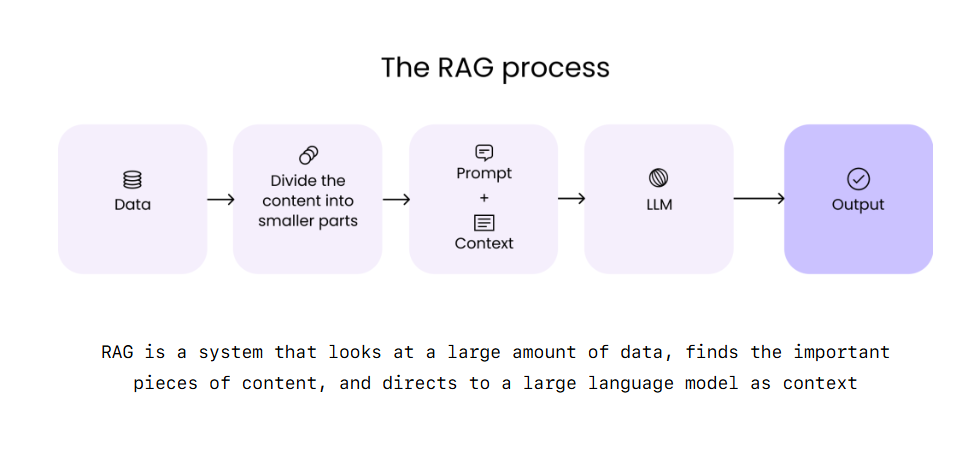

# Knowledge Process Repository
This repository contains theoretical and practical content related to:
- **Retrieval-Augmented Generation (RAG)**
- **AI Agents**
- **Agentic AI**

The goal is to provide a central knowledge hub combining concepts, workflows, and example implementations.

---

## 📌 Retrieval-Augmented Generation (RAG)

### 1. What is RAG?
Retrieval-Augmented Generation (RAG) is a technique that combines **information retrieval** and **text generation** to produce more accurate, context-aware, and up-to-date responses from Large Language Models (LLMs).  
Instead of relying solely on the LLM's pre-trained knowledge, RAG retrieves relevant documents from an **external knowledge source** (e.g., vector database, search index) and feeds them into the model as context.

---

### 2. Why RAG?
- **Factual accuracy** → reduces hallucinations by grounding outputs in retrieved facts.
- **Fresh knowledge** → can use the most recent data, even beyond the LLM's training cut-off.
- **Domain-specific customization** → tailor outputs using your own proprietary datasets.
- **Smaller models can act smarter** → retrieval compensates for limited parameters.

---

### 3. How RAG Works
1. **Query** → User asks a question or makes a request.
2. **Retrieve** → Search for relevant documents in an external data store (vector DB, Elasticsearch, Azure Cognitive Search, etc.).
3. **Augment** → Add the retrieved documents to the LLM’s input prompt.
4. **Generate** → LLM uses both its training + the retrieved content to produce a final answer.

**Workflow Diagram:**

### 4. Core Components
- **Retriever** → Finds the most relevant data (semantic search, embeddings, BM25, hybrid search).
- **Generator** → The LLM that creates the final output.
- **Knowledge Store** → A database or index for storing and searching documents.
- **Embedding Model** → Converts text into vector representations for similarity search.

### 5. Example Tech Stack for RAG
- **Data Storage**: Pinecone, Weaviate, Milvus, FAISS, Azure Cognitive Search, Elasticsearch
- **Embedding Models**: OpenAI text-embedding-ada-002, Hugging Face sentence transformers
- **LLMs**: GPT-4, LLaMA, Gemini etc. 
- **Orchestration**: 
        
  
        LangChain → Popular Python/JS framework for chaining LLM + retrieval steps.

        LlamaIndex (formerly GPT Index) → Simplifies indexing and retrieval for LLMs.

        Haystack (by deepset) → Open-source framework focused on RAG pipelines with Elasticsearch, FAISS, etc.

        CrewAI / AutoGen → For multi-agent and advanced orchestration use cases.

        Ragas → Evaluation + orchestration toolkit for RAG systems.
